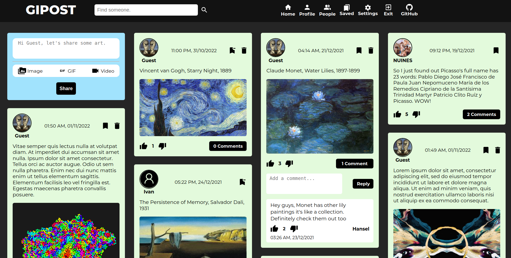

# Gipost



## Overview

Gipost is a full stack social media application for sharing art related content. It was created using React, Node.js, Express.js and MongoDB. This project is currently deployed and hosted on a cloud platform called Render as a demo site.

- [**See Live**](https://gipost.onrender.com) (Note: Render can take up to **1 minute to "wake up"** web services)

- **Features**
  - Sign in, sign up, account update options for username, email and password
  - Posting text, images, GIFs or videos with caption
  - Saving, deleting, liking and disliking posts
  - Commenting, liking and disliking comments
  - Search functionality for finding other users
  - Following and unfollowing others
  - Profile pages with editable profile picture and about section

## Installation

Make sure you have Node.js version >= 14.7.3 installed. Either use your OS's package manager or follow the instructions [here](https://nodejs.org/en/). This project uses MongoDB as its database. If you don't have it installed or not sure how to make the connection follow [these instructions](https://docs.mongodb.com/manual/installation/#mongodb-community-edition). Then, manually download this repository or clone it by running the command below.

```
$ git clone https://github.com/feyzanaydemir/gipost.git
```

- Change into the `/gipost` directory and install the server side requirements.

  ```
  $ cd gipost
  $ npm install
  ```

  To start the Node.js server and access it at `http://localhost:8000`, run:

  ```
  $ node app.js
  ```

- Change into the `/client` directory and install the client side requirements.

  ```
  $ cd client
  $ npm install
  ```

  To start the React development server and access it at `http://localhost:3000`, run:

  ```
  $ npm start
  ```

### Enviroment Variables

```
GUEST_PASSWORD=
GUEST_EMAIL=
SECRET=
ORIGIN=
DB_URI=
PORT=
```
